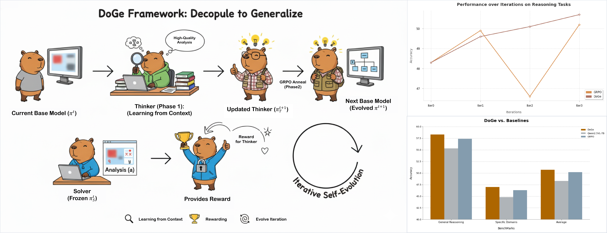

# DoGe: Decouple to Generalize 🚀

## Overview 🔍

DoGe (Decouple to Generalize) is a dual-decoupling reinforcement learning framework designed to enable **self-evolving learning for vision-language models (VLMs)** in data-scarce specialized domains (e.g., chemistry, earth science, multimodal mathematics). 

### Core Challenge Addressed
Traditional RL-based VLM training suffers from:
- Lack of high-quality multimodal data in specialized domains
- Reward hacking (models exploit high-reward shortcuts instead of genuine reasoning)
- Entropy collapse and poor generalization

### Key Innovation
DoGe restructures the model's cognitive process into a **"learning-application" cycle** by decoupling the policy into two complementary components:
1. 🤔 **Thinker**: Learns to deeply understand contextual information (without explicit questions) through free exploration
2. 🧩 **Solver**: Uses the Thinker's analysis to solve original tasks, providing quantitative rewards for the Thinker

### Training Pipeline
The framework adopts a two-stage RL training loop aligned with human cognitive logic:
1. **Stage 1 (Learning from Context)**: Train Thinker to analyze question-masked multimodal context; Solver's accuracy quantifies Thinker's performance
2. **Stage 2 (Learning from Application)**: Fine-tune Thinker on original tasks to internalize reasoning capabilities via GRPO annealing



### Data Synthesis
DoGe builds an iterative curriculum learning pipeline:
- 🌐 **Multimodal Knowledge Pool**: Aggregates unlabeled domain data (images + text) from web/databases
- 🔄 **Seed Problem Pool**: Dynamically updates with "occasionally solvable" problems to enhance data diversity

---

## Quick Start

### 🖥️ Environment Setup

Configure the environment according to the guidelines below：

```bash
# Example: Create and activate a virtual environment (replace with actual commands)
conda create -n doge python=3.10
conda activate doge

# clone this repository
git clone https://github.com/opendatalab-raiser/DoGe
cd DoGe

# Install dependency packages
pip install -r requirements.txt
```

### 📥 Dataset Download

You can directly download datasets from our official Huggingface Repository [DoGe](https://huggingface.co/datasets/opendatalab-raiser/DoGe):

```bash
# Create a dedicated directory for storing the dataset
mkdir -p data

# Clone the dataset repository from Hugging Face to the data directory
git clone https://huggingface.co/datasets/opendatalab-raiser/DoGe data/DoGe
cd data/DoGe

# Unzip the image archive file
tar -xzf imgs.tar.gz
```

### ▶️ Run Experiment

Replace the corresponding parameters in the startup file, including the dataset and model, with your actual paths:

```bash
# DoGe Training Stage 1: Thinker
bash scripts/run_qwen2_5_vl-7b_doge.sh

# DoGe Training Stage 2: Anneal
bash scripts/run_qwen2_5_vl-7b.sh
```


---

## Experiment Results 📊

We evaluate DoGe on **7 benchmarks** covering:
- General visual reasoning & hallucination (MMMU, MMStar, HallBench)
- Specialized domain reasoning (MathVision, MathVista, ChemBench, MSEarthMCQ)

### 3B-level Models Performance

| Method | MMMU | MMStar | HallBench | MathVision | MathVista | ChemBench | MSEarthMCQ | Avg. |
|--------|------|--------|-----------|------------|-----------|-----------|------------|------|
| InternVL2.5-2B | 43.6 | 53.7 | 42.6 | 13.5 | 51.3 | - | - | - |
| Visionary-3B | 40.7 | 50.5 | 59.8 | 17.1 | 54.7 | 40.8 | 38.2 | 43.1 |
| Qwen2.5VL-3B* (Base) | 41.0 | 49.3 | 60.6 | 18.7 | 48.8 | 43.4 | 40.8 | 43.2 |
| DoGe-3B (Iter1) | 46.6 | 54.5 | 61.5 | 21.7 | 🥇57.9 | 45.8 | 🥇48.3 | 48.0 |
| DoGe-3B (Iter2) | 48.9 | 52.5 | 🥇62.5 | 23.1 | 54.2 | 🥇47.7 | 46.2 | 47.9 |
| DoGe-3B (Iter3) | 🥇50.2 | 🥇54.7 | 61.8 | 🥇24.2 | 57.0 | 46.9 | 47.3 | 🥇48.9 |
| ⬆️ Max Gain (vs. Base) | +9.2 | +5.4 | +1.9 | +5.5 | +9.1 | +4.3 | +7.5 | +5.7 |

### 7B-level Models Performance

| Method | MMMU | MMStar | HallBench | MathVision | MathVista | ChemBench | MSEarthMCQ | Avg. |
|--------|------|--------|-----------|------------|-----------|-----------|------------|------|
| InternVL2.5-8B | 48.9 | 62.8 | 50.1 | 22.0 | 64.4 | - | - | - |
| Vision-R1-7B | 46.9 | 60.8 | 66.7 | 🥇29.0 | 68.5 | 46.0 | 44.1 | 51.7 |
| Qwen2.5VL-7B* (Base) | 49.9 | 60.7 | 66.3 | 23.6 | 64.1 | 48.6 | 43.3 | 50.9 |
| DoGe-7B (Iter1) | 53.1 | 🥇63.2 | 54.4 | 24.3 | 62.1 | 48.7 | 46.4 | 50.3 |
| DoGe-7B (Iter2) | 50.9 | 60.0 | 🥇68.3 | 25.3 | 🥇68.8 | 🥇49.0 | 🥇46.5 | 52.7 |
| DoGe-7B (Iter3) | 🥇53.6 | 63.0 | 68.0 | 25.2 | 68.3 | 48.5 | 45.8 | 🥇53.2 |
| ⬆️ Max Gain (vs. Base) | +3.7 | +2.5 | +2.0 | +1.7 | +4.7 | +0.4 | +3.2 | +2.3 |

### Key Takeaways ✨
1. **Stable Self-Evolution**: DoGe achieves consistent performance improvement across 3 iterations for both 3B and 7B models
2. **Domain Generalization**: 
   - 3B models: Average +5.7% performance gain across all benchmarks
   - 7B models: Average +2.3% performance gain (maintains superiority over strong baselines)
3. **Hallucination Reduction**: +2.0% average improvement on HallBench, mitigating visual hallucination
4. **Data Efficiency**: Excels in data-scarce domains (Chemistry, Earth Science) with limited manual annotations

### Visualization Highlights
- 📈 Higher policy entropy throughout training (avoids entropy collapse)
- 🌐 Wider distribution of synthetic training data compared to manual annotations
- 🔄 Stable performance across iterations (unlike baseline's fluctuating results)

---

## 🙏 Acknowledgements

The code implementation of our work is based on [**verl**](https://github.com/volcengine/verl), and we would like to express our gratitude to this project for providing an excellent VLM reinforcement learning toolkit.

## ✍️ Citation

```bibtex
@misc{li2025decouplegeneralizecontextfirstselfevolving,
      title={Decouple to Generalize: Context-First Self-Evolving Learning for Data-Scarce Vision-Language Reasoning}, 
      author={Tingyu Li and Zheng Sun and Jingxuan Wei and Siyuan Li and Conghui He and Lijun Wu and Cheng Tan},
      year={2025},
      eprint={2512.06835},
      archivePrefix={arXiv},
      primaryClass={cs.AI},
      url={https://arxiv.org/abs/2512.06835}, 
}
```
